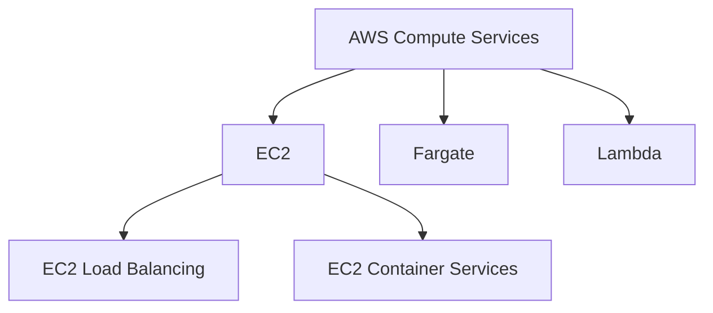

Compute Services refer to the computing capacity that is traditionally provided by on-prem servers.

```mermaid
graph
Compute[AWS Compute Services]-->EC2
EC2-->EC2LB[EC2 Load Balancing]
EC2-->EC2CS[EC2 Container Services]
Compute-->Fargate
Compute--> Lambda
```
