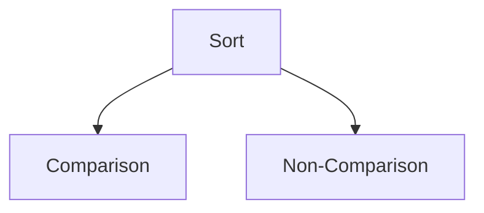

Sorts are algos which arranges given data elements either in ascending or descending orders like numerical, lexicographic, etc. The output of a sort doesn't change the data in any way but only the ordering. 

There are multiple ways sorting algorithms can be classified -
- Recursion
- Stability
- Comparability
- Method
- Concurrency

## Sort Stability
Sort stability comes to

### Comparison Sorts

| Name            | Best Case | Avg Case      | Worst Case    | Memory | Stability | Comments |
| --------------- | --------- | ------------- | ------------- | ------ | --------- | -------- |
| [[Bubble Sort]] | $n$       | $n$ * log $n$ | $n$ * log $n$ | $1$    | Yes       |          |
| [[Heap Sort]]   |           |               |               |        |           |          |
| Insertion Sort  |           |               |               |        |           |          |
| Merge Sort      |           |               |               |        |           |          |
| Quick Sort      |           |               |               |        |           |          |
| Selection Sort  |           |               |               |        |           |          |
|                 |           |               |               |        |           |          |

### Non-Comparison Sorts 