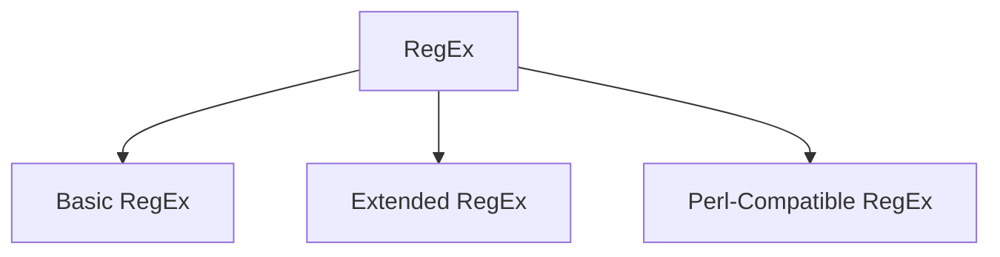

Regular Expression or RegEx is a sequence of character that specifies a match pattern in text. The name regex comes from a mathematical theory of [regular language](https://en.wikipedia.org/wiki/Regular_language). It's used extensively in text processing. 

Sample use cases include but not limited to -
- Input validation on text fields
- Search & Replace in single/multiple text file(s)
- Embedded text data filtering in dataset(s)
- Data Cleaning and Preprocessing
- Log Analysis

Sample RegEx for validating email addresses -
```regex
^([a-zA-Z0-9_\-\.]+)@([a-zA-Z0-9_\-\.]+)\.([a-zA-Z]{2,5})$
```

## Variations
A regex “engine” is a piece of software that can process regular expressions, trying to match the pattern to the given string. 

Regex engines are not fully compatible with each other. The syntax and behavior of a particular engine is called a regular expression flavor. There are 3 basic flavors -




>[!tip] Each programming language offers a different flavor of RegEx but typically it's based on one of the above flavors

### Basic RegEx


### Extended RegEx


### Perl-Compatible RegEx


## Resources
- [regex101](https://regex101.com/) - Build & Test RegEx from browser!
- [GeeksforGeeks article on RegEx](https://www.geeksforgeeks.org/dsa/write-regular-expressions/)
- [Regex tutorial](https://www.regular-expressions.info/)