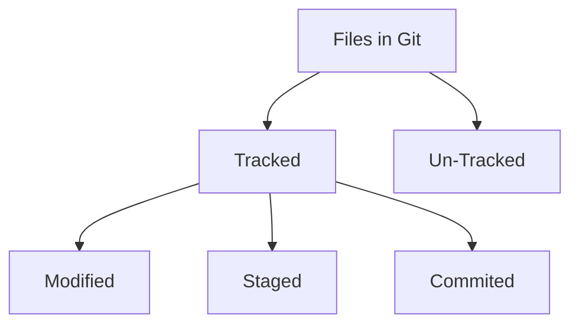
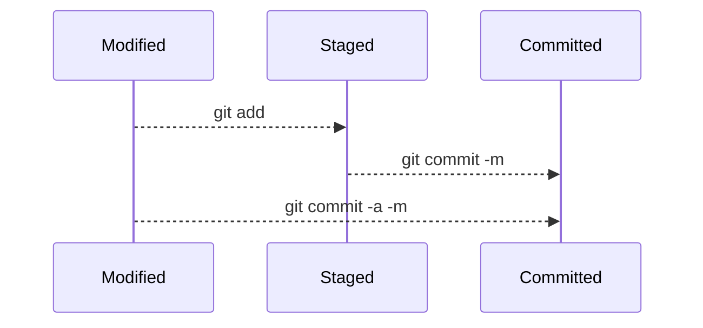

Git is a distributed version control system that tracks versions of files.

## Installing & Configuring Git
Git can be installed from [Git's Website](https://git-scm.com/downloads).
After installation, mail & user-name needs to be set as below -
```bash
git config --global user.email "user@host.com"
git config --global user.name "Saptarshi"
```
The `--global` option sets the values for all repos. To set individually, we need to remove the `--global` option & perform it for each repo that we want to use.
`git config -l` shows us the current git config from the config file.

## Creating a Git Repo
A Git Repo can be created by cloning an existing repo or by creating from scratch. To create a repo from scratch, we can simply write `git init` and it would create an empty repo with `.git` folder.
For cloning, we need to specify the path of the repo that we want to clone in the command like -
```bash
git clone https://github.com/ghoshsaptarshi/Send2Kindle.git
```
In both the cases, it creates a `.git` directory inside the repo, which contains metadata of the Repo. Area outside the directory is called **Working Directory**. We can add files to the repo's staging area by -
```bash
git add file.ext
```

>[!tip] Staging Area
> It's a file mantained by Git that contains all of the info about what files and changes are going into next commit.

We can check the status of the repo by issuing `git status` command. For commiting changes to the repo, we need to use `git commit`.

* * *

## Important points about tracking files using Git
1. The `.git` directory contains the history of all the files and changes
2. Working tree contains the current state of the project including any change that we've made.
3. Staging Area contains changes marked to be in next commit
4. For each commit, Git records a new snapshot of the entire repo


## Types of Tracked files


1. Files which are changed but not yet added to staging library i.e. not ready for commit are called as ==Modified==.
2. Files which are added to staging library i.e. ready to be committed are called as ==Staged==.
3. Files which are finally added to the repo after changes are ==Committed==.


## Git Workflow



To add a modified file to staging area we need to use `git add`. We can later commit the staging area by issuing `git commit -m`. Each commit requires a commit message which describe the changes done in the particular commit.
We can use `git log` to show the messages & verify the commit.

